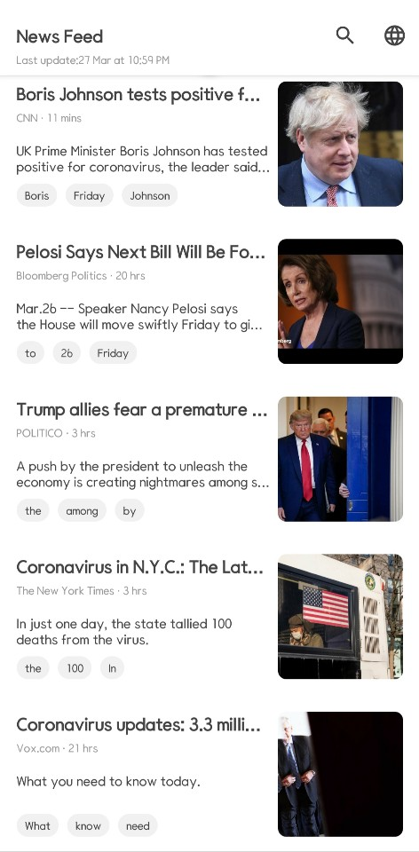

# NewsFeedApp

Created: 2020-03-16

Last Updated: 2020-03-27

## Screenshot

   

## Description

You can check the news feed in real time, and search to find the news you want.

Supports various languages.

## Skills

* ViewModel
* [Splitties](https://github.com/LouisCAD/Splitties) ([Instead of Anko](https://github.com/Kotlin/anko/blob/master/GOODBYE.md))
* Glide
* Lottie (For animation)
* RxKotlin, RxAndroid
* Koin (Dependency injection)
* Jsoup (For parsing open graph tag)
* RssParser
* Material Design
